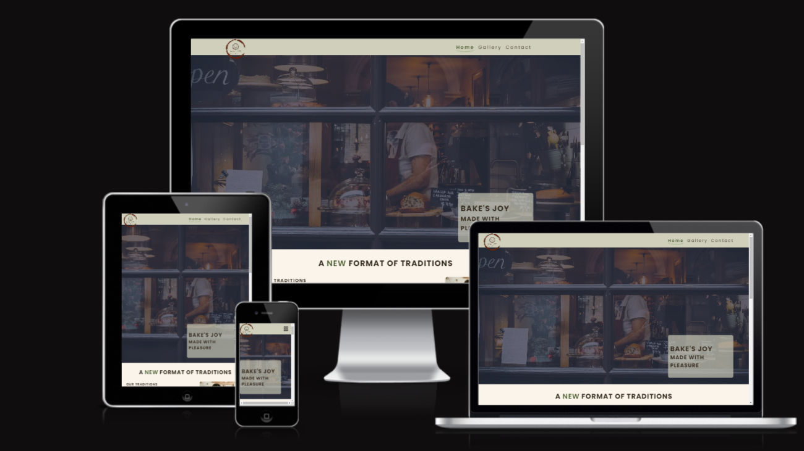
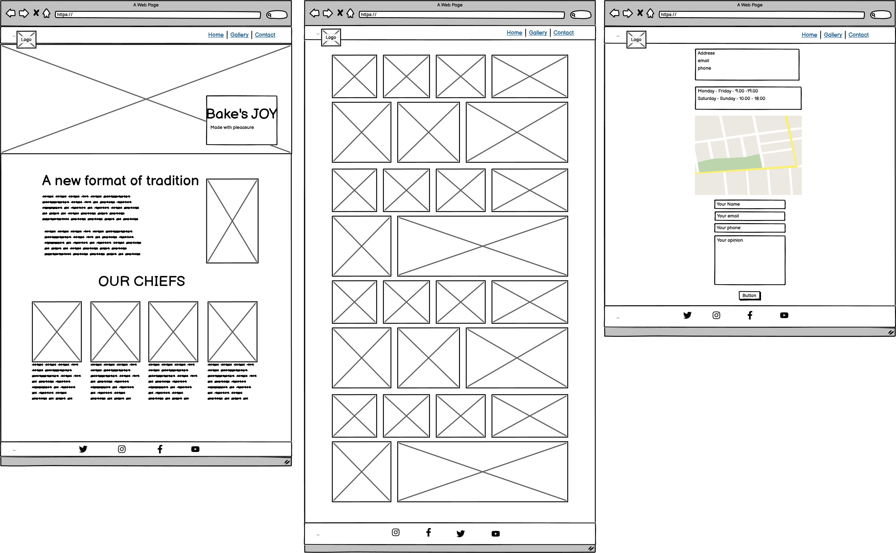
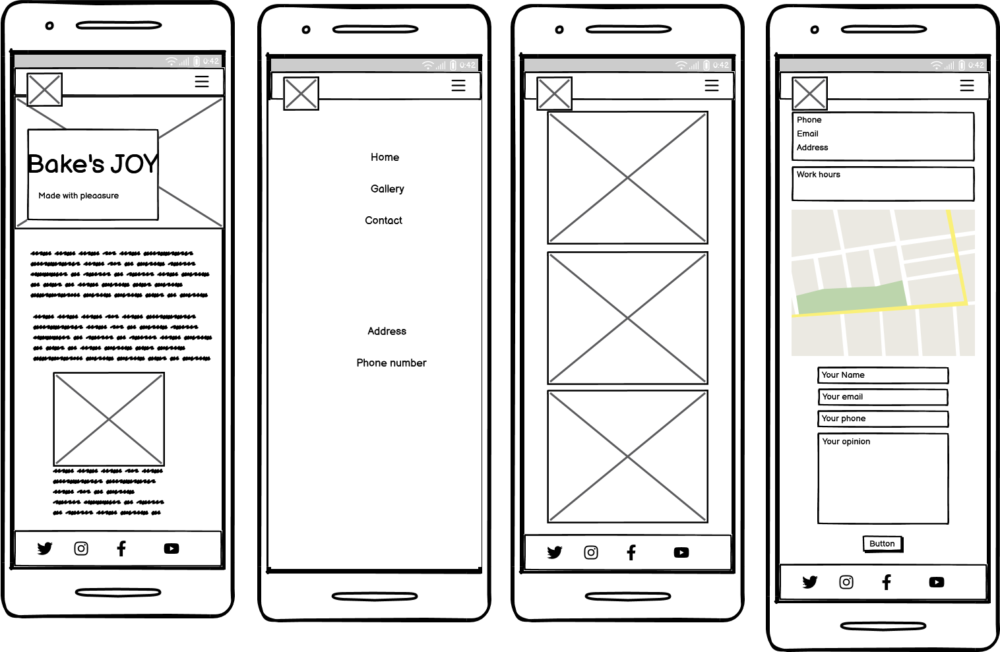
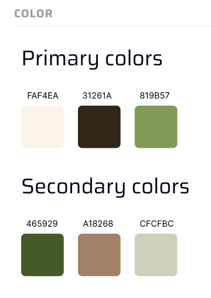
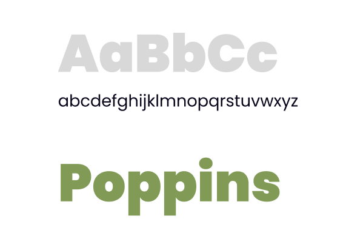
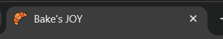
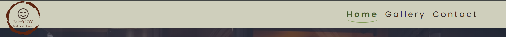
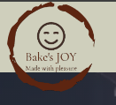
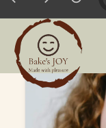
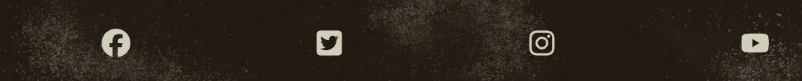

# Bake's JOY - A Modern Bakery With Old Traditions

## Introduction

The website presents a modern family bakery in which ancient traditions have
been preserved. With the help of the gallery on the website, the buyer can
immerse himself in the wonderful world of sweet pastries. We invite you to come
to our institution.

You can [visit our site here.](https://barkode.github.io/bake-with-joy/)

## Content

- [User Experience](#user-experience-ux)
  - [User Stories](#user-stories)
- [Design](#design)
  - [Website Structure](#website-structure)
  - [Wireframes](#wireframes)
  - [Color Scheme](#color-scheme)
  - [Typography](#typography)
  - [Media content](#imagery)
  - [Accessibility](#accessibility)
- [Features](#features)
  - [Favicon](#favicon)
  - [Header](#header)
  - [Logo](#logo)
  - [Navigation Menu](#navigation-menu)
  - [Footer](#footer)
- [Technologies and Media](#technologies-used)
- [Deployment](#deployment)
  - [Deployment to Github pages](#github-pages)
  - [Fork repository](#forking-the-github-repository)
  - [Clone repository](#making-a-local-clone)
- [Testing](#testing)
- [Future improvements](#future-improvements)
- [Credits](#credits)

## User Experience (UX)

### User stories

The user stories upon which the features of the project are based are as
follows:

1. As a visiting user, I want to be able to navigate this site easily.

2. As a visiting user, I want to know what services are provided by this
   business so that I can quickly determine if it may be able to meet my needs.

3. As a visiting user, I want to know if the business has a track record of
   providing these services.

4. As a visiting user, I would like to see some examples of previous work the
   business has done.

5. As a visiting user, I want to know how to contact the business if I have a
   query or if I think it can provide the service I need.

[Back to top](#content)

## Design

The design was built on the principle of simplicity. The site should be simple
and at the same time user-friendly.

- ### Website structure

The site consists of 5 pages. The navigation menu is available on all pages.

- The home page presents the main idea of ​​the site.

- On the second page, you can see a gallery presenting examples of products.

- The third page is a page with contacts and a feedback form.

- The last two pages are service pages. One of them shows a message that the
  form has been completed, and the other reports that an error has occurred. The
  home page is the default download page.

- The header is fixed on the page, so it is available to the client at any time.

- The logo is located in the upper left corner and the navigation menu is
  located in the right corner. On devices with a small screen, this navigation
  menu changes to a drop-down menu.

- Also on the site there is a lower part - a footer. With its help, the client
  can go to the page of one of the social networks.

[Back to top](#content)

- ### Wireframes

Balsamiq was used to create the wireframes during the design process

[Back to top](#content)

- ### Color Scheme

The color scheme for this project used from
[Figma design](https://www.figma.com/design/fDlsHwelyuOVsfUmCzm3dA/%D0%A1%D1%83%D1%87%D0%B0%D1%81%D0%BD%D1%8F-%D0%BF%D0%B5%D0%BA%D0%B0%D1%80%D0%BD%D1%8F?node-id=0-1&t=X9B2jIUsiA3Fm8p6-0)

[Back to top](#content)

- ### Typography

Geometric sans serif typefaces have always been popular, and with support for
both the Devanagari and Latin writing systems, Poppins is an internationalist
addition to the genre. Many of the Latin glyphs (such as the ampersand) are more
constructed and rationalist than is typical. The font family
'[Poppins](https://gwfh.mranftl.com/fonts/poppins?subsets=latin)' was downloaded
and used from Google Fonts, as it provides an easy-on-the-eye font. This font
was used for all text across the website.

[Back to top](#content)

- ### Imagery

All images were downloaded from free resources. Pictures for the site were
downloaded from such resources as [Pixels](https://www.pexels.com/),
[Pixabay](https://pixabay.com/) and [Unsplash](https://unsplash.com/).

Icons for the project were found on [FontAwesome](https://fontawesome.com/) and
[FLATICON](https://www.flaticon.com/).

All image sizes were edited using [squoosh](https://squoosh.app/).

[Back to top](#content)

- ### Accessibility

The following has been done to ensure that the website is as accessible friendly
as possible.

- Using semantic HTML.
- Using descriptive alt attributes on images on the site.
- Ensuring that there is a sufficient color contrast throughout the site.

[Back to top](#content)

## Technologies Used

- ### Languages Used

- HTML5 - used to write structure and foundation of code for website.
- CSS3 - used for styling all content and page structure on site.
- Git - used to track code changes and as a version control system.

[Back to top](#content)

### Frameworks, Libraries & Programs Used

- #### [Google fonts](https://fonts.google.com/knowledge) and [google webfonts helper](https://gwfh.mranftl.com/fonts)

Google fonts and google webfonts helper were used to integrate the 'Poppins'
font into the style.css file which is used on all pages throughout the project

- #### [Font Awesome](https://fontawesome.com/)

Font Awesome was used on all pages throughout the website to add icons for
aesthetic and UX purposes.

- #### [Git](https://gitpod.io/)

Git was used for version control by utilizing the Gitpod terminal to commit to
Git and Push to GitHub.

- #### [GitHub](https://github.com/)

GitHub is used to store the projects code after being pushed from Git.

- #### [Balsamiq](https://balsamiq.com/wireframes/)

Balsamiq was used to create [wireframes](#wireframes) for website.

- #### [Figma](https://www.figma.com/community)

Figma was used to find inspiration.

- #### [Visual Studio Code](https://code.visualstudio.com/)

  Used Visual Studio Code as a main IDE.

[Back to top](#content)

## Features

The site contains 5 pages. All pages have a favicon, logo, navigation menu and
footer.

- ### Favicon

An icon suitable for the subject was found on the
[FlatIcon](https://www.flaticon.com/free-icon/croissant_786967?term=croissant&page=2&position=5&origin=search&related_id=786967)
resource.

- ### Header

The header has been made fixed for easy access to the navigation menu.

[Back to top](#content)

- ### Logo

The logo was generated using [app-logo](https://app.logo.com/). The logo has a
transparent background and has been moved outside the header. This creates an
effect as if the logo is flying.

[Back to top](#content)

- ### Navigation Menu

[Back to top](#content)

- ### Footer

[Back to top](#content)

## Testing

## Testing user stories

### Further testing

## Bugs

## Deployment

- ### Github pages

  - This project was deployed to GitHub Pages using the following steps

    - Log in to GitHub and locate the GitHub Repository
    - At the top of the Repository (not top of page), locate the "Settings"
      Button on the menu.
    - Scroll down the Settings page until you locate the "GitHub Pages" Section.
    - Under "Source", click the dropdown called "None" and select "Main Branch".
    - The page will automatically refresh.
    - Scroll back down through the page to locate the now published site link in
      the "GitHub Pages" section.
    - live link for the page can be found here
      [Bake's JOY](https://barkode.github.io/bake-with-joy/)

[Back to top](#content)

- ### Forking the GitHub Repository

  - By forking the GitHub Repository we make a copy of the original repository
    on our GitHub account to view and/or make changes without affecting the
    original repository by using the following steps
  - Log in to GitHub and locate the GitHub Repository
  - At the top of the Repository (not top of page) just above the "Settings"
    Button on the menu, locate the "Fork" Button.
  - You should now have a copy of the original repository in your GitHub
    account.

[Back to top](#content)

- ### Making a Local Clone

  - Log in to GitHub and locate the GitHub Repository
  - Under the repository name, click "Clone or download".
  - To clone the repository using HTTPS, under "Clone with HTTPS", copy the
    link.
  - Open Git Bash
  - Change the current working directory to the location where you want the
    cloned directory to be made
  - Type git clone, and then paste the URL you copied in Step 3.
    - $ git clone <https://github.com/YOUR-USERNAME/YOUR-REPOSITORY>
  - Press Enter. Your local clone will be created.

[Back to top](#content)

## Future improvements

[Back to top](#content)

## Credits

- Code & Content
  - I give credits to [Stack overflow](https://www.stackoverflow.com/),
    [MDN Web Docs](https://developer.mozilla.org/en-US/),
    [W3 Schools](https://www.w3schools.com/) &
    [LogRocket](https://blog.logrocket.com/) for helping me resolve issues while
    coding through
  - inspiration for my subject and color pallet goes from
    [Figma](https://www.figma.com/design/fDlsHwelyuOVsfUmCzm3dA/%D0%A1%D1%83%D1%87%D0%B0%D1%81%D0%BD%D1%8F-%D0%BF%D0%B5%D0%BA%D0%B0%D1%80%D0%BD%D1%8F?node-id=0-1&t=VeNx8IUKIo2EOdRB-0)
  - Love running project from [Code Institute](https://codeinstitute.net/ie/)
    inspired me for the Gallery page
  - credits for hover effect over images and other effects for elements goes to
    [Brandsmen](https://thebrandsmen.com/css-image-hover-effects/) and
    [UIVerse](https://uiverse.io/)
  - credits for gallery goes from
    [LogRocket](https://blog.logrocket.com/responsive-image-gallery-css-flexbox/)
- Media
  - credit for my images across the website goes to
    [Unsplash](https://unsplash.com/) and [Pexell](https://www.pexels.com/)
    which I used across my website
  - for my logo I give credit to [app-logo](https://app.logo.com/) for easily
    generating my idea and automatic creating logo for my website
  - instructions how to create my favicon came from
    [MDN Web Docs](https://developer.mozilla.org/en-US/)
  - my favicon I found on [FlatIcon](https://www.flaticon.com/)
  - for optimize images was used [Squoosh](https://squoosh.app/) service
- Acknowledgment

[Back to top](#content)
