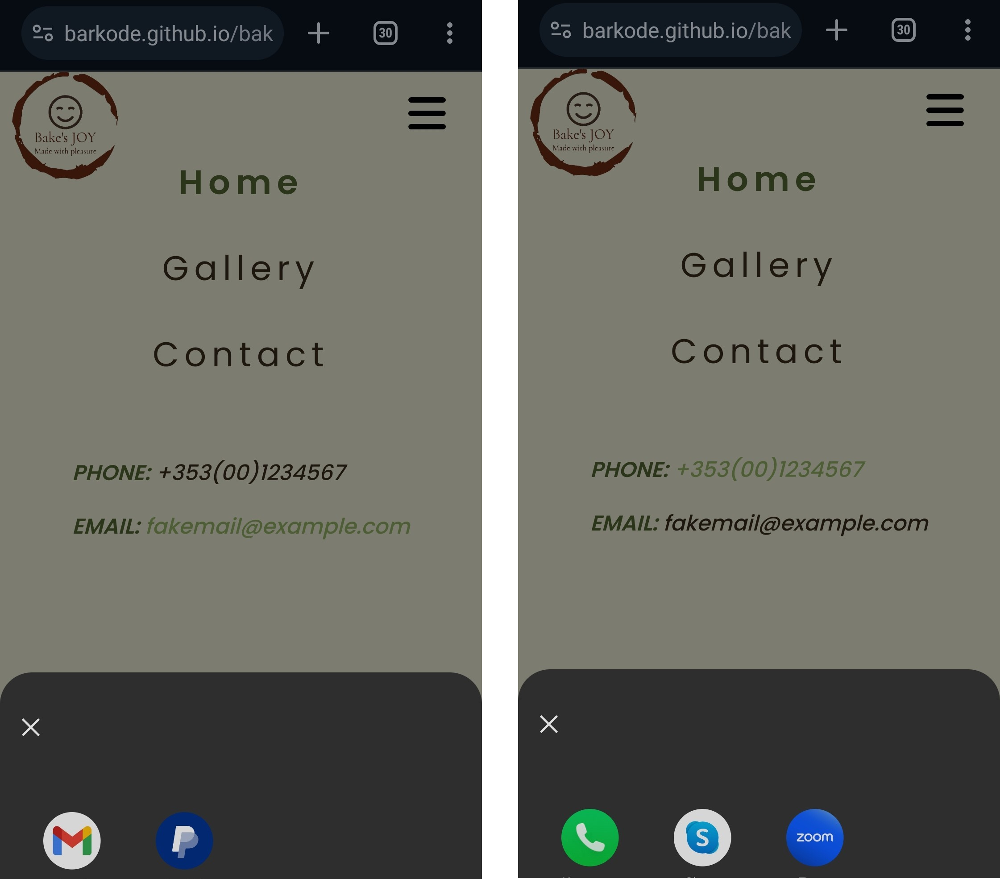
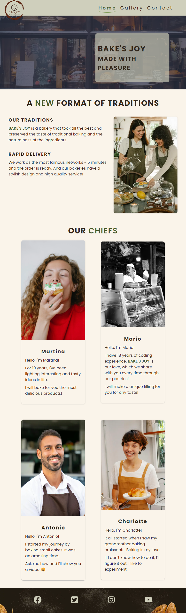
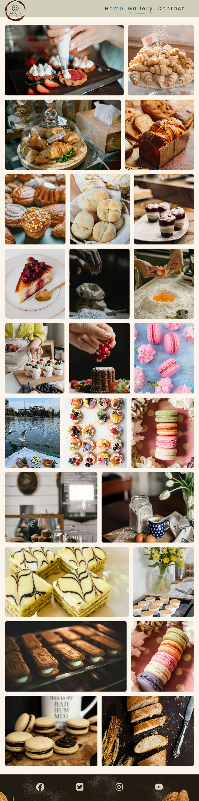
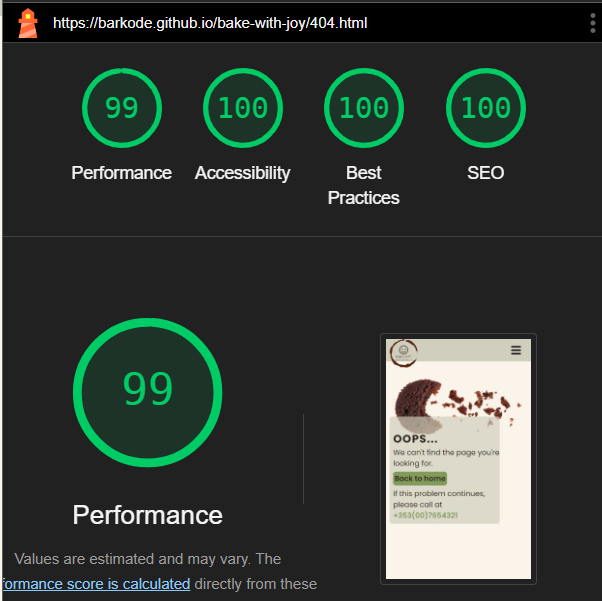

# Bake's JOY - A Modern Bakery With Old Traditions

## Introduction

The website presents a modern family bakery in which ancient traditions have
been preserved. With the help of the gallery on the website, the buyer can
immerse himself in the wonderful world of sweet pastries. We invite you to come
to our institution.

You can [visit our site here.](https://barkode.github.io/bake-with-joy/)

## Content

- [User Experience](#user-experience-ux)
  - [User Stories](#user-stories)
- [Design](#design)
  - [Website Structure](#website-structure)
  - [Wireframes](#wireframes)
  - [Color Scheme](#color-scheme)
  - [Typography](#typography)
  - [Media Content](#imagery)
  - [Accessibility](#accessibility)
- [Features](#features)
  - [Favicon](#favicon)
  - [Header](#header)
  - [Logo](#logo)
  - [Navigation Menu](#navigation-menu)
  - [Footer](#footer)
  - [Home Page](#home-page)
  - [Gallery Page](#gallery-page)
  - [Contact Page](#contact-page)
  - [Error Page](#error-page)
  - [Confirmation Page](#confirmation-page)
- [Technologies and Media](#technologies-used)
- [Deployment](#deployment)
  - [Deployment to Github Pages](#github-pages)
  - [Fork Repository](#forking-the-github-repository)
  - [Clone Repository](#making-a-local-clone)
- [Testing](#testing)
  - [Testing User Stories](#testing-user-stories)
  - [HTML Validation](#html-validation)
    - [Home Page](#home-page)
    - [Gallery Page](#gallery-page)
    - [Contact Page](#contact-page)
    - [Error Page](#error-page)
    - [Confirmation Page](#confirmation-page)
  - [CSS Validation](#css-validation)
  - [Lighthouse Performance Tests](#lighthouse-performance-tests)
    - [Desktop](#desktop)
    - [Mobile](#mobile)
  - [Manual Testing](#manual-testing)
- [Future Improvements](#future-improvements)
- [Credits](#credits)

## User Experience (UX)

### User stories

The user stories upon which the features of the project are based are as
follows:

1. As a visiting user, I want to be able to navigate this site easily.

2. As a visiting user, I want to know what services are provided by this
   business so that I can quickly determine if it may be able to meet my needs.

3. As a visiting user, I want to know if the business has a track record of
   providing these services.

4. As a visiting user, I would like to see some examples of previous work the
   business has done.

5. As a visiting user, I want to know how to contact the business if I have a
   query or if I think it can provide the service I need.

[Back to top](#content)

## Design

The design was built on the principle of simplicity. The site should be simple
and at the same time user-friendly.

[Back to top](#content)

### Website structure

The site consists of 5 pages. The navigation menu is available on all pages.

- The home page presents the main idea of ​​the site.

- On the second page, you can see a gallery presenting examples of products.

- The third page is a page with contacts and a feedback form.

- The last two pages are service pages. One of them shows a message that the
  form has been completed, and the other reports that an error has occurred. The
  home page is the default download page.

- The header is fixed on the page, so it is available to the client at any time.

- The logo is located in the upper left corner and the navigation menu is
  located in the right corner. On devices with a small screen, this navigation
  menu changes to a drop-down menu.

- Also on the site there is a lower part - a footer. With its help, the client
  can go to the page of one of the social networks.

[Back to top](#content)

### Wireframes

Balsamiq was used to create the wireframes during the design process

[Back to top](#content)

### Color Scheme

The color scheme for this project used from
[Figma design](https://www.figma.com/design/fDlsHwelyuOVsfUmCzm3dA/%D0%A1%D1%83%D1%87%D0%B0%D1%81%D0%BD%D1%8F-%D0%BF%D0%B5%D0%BA%D0%B0%D1%80%D0%BD%D1%8F?node-id=0-1&t=X9B2jIUsiA3Fm8p6-0)

[Back to top](#content)

### Typography

Geometric sans serif typefaces have always been popular, and with support for
both the Devanagari and Latin writing systems, Poppins is an internationalist
addition to the genre. Many of the Latin glyphs (such as the ampersand) are more
constructed and rationalist than is typical. The font family
'[Poppins](https://gwfh.mranftl.com/fonts/poppins?subsets=latin)' was downloaded
and used from Google Fonts, as it provides an easy-on-the-eye font. This font
was used for all text across the website.

[Back to top](#content)

### Imagery

All images were downloaded from free resources. Pictures for the site were
downloaded from such resources as [Pixels](https://www.pexels.com/),
[Pixabay](https://pixabay.com/) and [Unsplash](https://unsplash.com/).

Icons for the project were found on [FontAwesome](https://fontawesome.com/) and
[FLATICON](https://www.flaticon.com/).

All image sizes were edited using [squoosh](https://squoosh.app/).

[Back to top](#content)

### Accessibility

The following has been done to ensure that the website is as accessible friendly
as possible.

- Using semantic HTML.
- Using descriptive alt attributes on images on the site.
- Ensuring that there is a sufficient color contrast throughout the site.

[Back to top](#content)

## Technologies Used

### Languages Used

- HTML5 - used to write structure and foundation of code for website.
- CSS3 - used for styling all content and page structure on site.
- Git - used to track code changes and as a version control system.

[Back to top](#content)

### Frameworks, Libraries & Programs Used

#### [Google fonts](https://fonts.google.com/knowledge) and [google webfonts helper](https://gwfh.mranftl.com/fonts)

Google fonts and google webfonts helper were used to integrate the 'Poppins'
font into the style.css file which is used on all pages throughout the project

#### [Font Awesome](https://fontawesome.com/)

Font Awesome was used on all pages throughout the website to add icons for
aesthetic and UX purposes.

#### [Git](https://gitpod.io/)

Git was used for version control by utilizing the Gitpod terminal to commit to
Git and Push to GitHub.

#### [GitHub](https://github.com/)

GitHub is used to store the projects code after being pushed from Git.

#### [Balsamiq](https://balsamiq.com/wireframes/)

Balsamiq was used to create [wireframes](#wireframes) for website.

#### [Figma](https://www.figma.com/community)

Figma was used to find inspiration.

#### [Visual Studio Code](https://code.visualstudio.com/)

Used Visual Studio Code as a main IDE.

[Back to top](#content)

## Features

The site contains 5 pages. All pages have a favicon, logo, navigation menu and
footer.

### Favicon

An icon suitable for the subject was found on the
[FlatIcon](https://www.flaticon.com/free-icon/croissant_786967?term=croissant&page=2&position=5&origin=search&related_id=786967)
resource.

[Back to top](#content)

### Header

The header has been made fixed for easy access to the navigation menu.

For small screens, the header has been changed for greater user convenience. The
navigation menu has been hidden to allow the user to see more content on a small
screen.

[Back to top](#content)

### Logo

The logo was generated using [app-logo](https://app.logo.com/).

The logo has a transparent background and has been moved outside the header.
This creates an effect as if the logo is flying.

[Back to top](#content)

### Navigation Menu

In the navigation menu, the technique of changing color and adding an underline
with rounded edges for the active page was used. This was done for the
convenience of the customer. So that the client always understands which page he
is currently on.

For small screens, such as mobile phones, the navigation bar has been changed
for greater user convenience.

All links are interactive and used for the convenience of the client. If you
type in a phone number with me, the phone will offer the client to make a call
using the phone.

[Back to top](#content)

### Footer

A link to the bakery's social networks was placed in the footer. For the
convenience of the user, the technique of highlighting the icons when pointing
with the mouse was used.

[Back to top](#content)

### Home page

On the main page, the client can see the logo behind the slogan. Next, he can
read information about our values. Below is a section that shows the chefs'
names.

- **On Desktop**

The team gallery is adaptive. And depending on the width of the screen, it can
show 1, 2 or 4 elements per line.

- **On Tablet**

- **On Mobile**

[Back to top](#content)

### Gallery page

The gallery page shows examples of delicious baked goods. The gallery is
interactive. If the client likes a picture, he can download the full version of
the picture. Thanks to the
[LogRocket](https://blog.logrocket.com/responsive-image-gallery-css-flexbox/)
portal, it was possible to make a responsive gallery that adjusts to the width
of the screen.

- **On Desktop**

- **On Tablet**

- **On Mobile**

[Back to top](#content)

### Contact page

The contact page was made in a minimalistic design. The page was made taking
into account different screen widths.

The page uses interactive elements in the address block. Which add convenience
to using the site on mobile devices.

Working hours were also shown on the page. They were organized in the form of a
table.

For the convenience of customers, a map was integrated into the site, which was
created using the [Google Maps](https://www.google.ie/maps/preview) service.

For the convenience of customers, a feedback form has been integrated into the
site.

[Back to top](#content)

### Error page

An error page notifies the user of an error. Also, the user can return to the
main page or use the interactive link and call and report the error. The page is
also made taking into account different device widths.

[Back to top](#content)

### Confirmation page

The confirmation page lets the client know that the request has been sent. The
page is also made taking into account different device widths.

[Back to top](#content)

## Testing

### Testing user stories

### HTML Validation

- #### Home Page

The document has been verified. No errors were found. Non-critical comments were
found.

All informational messages refer to the trailing slash at the end of empty
elements. This is a feature of the Prettier expansion.

[Back to top](#content)

- #### Gallery Page

The document has been verified. No errors were found. Non-critical comments were
found.

All informational messages refer to the trailing slash at the end of empty
elements. This is a feature of the Prettier expansion.

[Back to top](#content)

- #### Contact Page

The document has been verified. No errors were found. Non-critical comments were
found.

All informational messages refer to the trailing slash at the end of empty
elements. This is a feature of the Prettier expansion.

[Back to top](#content)

- #### Error Page

The document has been verified. No errors were found. Non-critical comments were
found.

All informational messages refer to the trailing slash at the end of empty
elements. This is a feature of the Prettier expansion.

[Back to top](#content)

- #### Confirmation Page

The document has been verified. No errors were found. Non-critical comments were
found.

All informational messages refer to the trailing slash at the end of empty
elements. This is a feature of the Prettier expansion.

[Back to top](#content)

### CSS Validation

The CSS code was validated using the
[W3C CSS Validation Service](https://jigsaw.w3.org/css-validator/validator.html.en)
to ensure there are no errors and it adheres to best practices.

Most of these warnings are related to CSS variables (custom properties) not
being statically checked.

[Back to top](#content)

### Lighthouse Performance Tests

#### Desktop

- Home Page

[Back to top](#content)

- Gallery Page

[Back to top](#content)

- Contact Page

[Back to top](#content)

- Error Page

[Back to top](#content)

- Confirmation Page

[Back to top](#content)

#### Mobile

- Home Page

[Back to top](#content)

- Gallery Page

[Back to top](#content)

- Contact Page

[Back to top](#content)

- Error Page

[Back to top](#content)

- Confirmation Page

[Back to top](#content)

### Further Testing

### Manual Testing

All buttons and links were tested during website creation. The final test was
done. The result of the final test is given in the table below.

| Feature                           | Expectation                                                                     | Action                                                        | Result                                       |
| :-------------------------------- | :------------------------------------------------------------------------------ | :------------------------------------------------------------ | :------------------------------------------- |
| Navigation menu links             | Transfers the client to the appropriate page                                    | Click the link                                                | The corresponding page is loaded             |
| Stylized buttons and links        | Change color when hovering over them                                            | Hover over a button or link                                   | The color changes                            |
| "Send" message button             | Submits the form                                                                | Click the button                                              | The form has been sent                       |
| Submit the form with blank fields | The form cannot be submitted with empty fields. Show a tooltip to the user      | The submission was verified with empty fields                 | The form was not submitted. A hint was shown |
| Submitted form page               | Show a page with a message to the user that the form was submitted successfully | Form submitted                                                | The page showed up                           |
| Social media links                | Links to social networks should open externally                                 | Clicked on the social network icons at the bottom of the page | The link will open in a new tab              |
| Opening the page with an error    | Opening the page with an error                                                  | Enter a non-existent page in the address bar                  | An error page has opened                     |

[Back to top](#content)

## Bugs

[Back to top](#content)

## Deployment

### Github pages

- This project was deployed to GitHub Pages using the following steps

  - Log in to GitHub and locate the GitHub Repository
  - At the top of the Repository (not top of page), locate the "Settings" Button
    on the menu.
  - Scroll down the Settings page until you locate the "GitHub Pages" Section.
  - Under "Source", click the dropdown called "None" and select "Main Branch".
  - The page will automatically refresh.
  - Scroll back down through the page to locate the now published site link in
    the "GitHub Pages" section.
  - live link for the page can be found here
    [Bake's JOY](https://barkode.github.io/bake-with-joy/)

[Back to top](#content)

### Forking the GitHub Repository

- By forking the GitHub Repository we make a copy of the original repository on
  our GitHub account to view and/or make changes without affecting the original
  repository by using the following steps
- Log in to GitHub and locate the GitHub Repository
- At the top of the Repository (not top of page) just above the "Settings"
  Button on the menu, locate the "Fork" Button.
- You should now have a copy of the original repository in your GitHub account.

[Back to top](#content)

### Making a Local Clone

- Log in to GitHub and locate the GitHub Repository
- Under the repository name, click "Clone or download".
- To clone the repository using HTTPS, under "Clone with HTTPS", copy the link.
- Open Git Bash
- Change the current working directory to the location where you want the cloned
  directory to be made
- Type git clone, and then paste the URL you copied in Step 3.
  - $ git clone <https://github.com/YOUR-USERNAME/YOUR-REPOSITORY>
- Press Enter. Your local clone will be created.

[Back to top](#content)

## Future improvements

[Back to top](#content)

## Credits

- Code & Content
  - I give credits to [Stack overflow](https://www.stackoverflow.com/),
    [MDN Web Docs](https://developer.mozilla.org/en-US/),
    [W3 Schools](https://www.w3schools.com/) &
    [LogRocket](https://blog.logrocket.com/) for helping me resolve issues while
    coding through
  - inspiration for my subject and color pallet goes from
    [Figma](https://www.figma.com/design/fDlsHwelyuOVsfUmCzm3dA/%D0%A1%D1%83%D1%87%D0%B0%D1%81%D0%BD%D1%8F-%D0%BF%D0%B5%D0%BA%D0%B0%D1%80%D0%BD%D1%8F?node-id=0-1&t=VeNx8IUKIo2EOdRB-0)
  - Love running project from [Code Institute](https://codeinstitute.net/ie/)
    inspired me for the Gallery page
  - credits for hover effect over images and other effects for elements goes to
    [Brandsmen](https://thebrandsmen.com/css-image-hover-effects/) and
    [UIVerse](https://uiverse.io/)
  - credits for gallery goes from
    [LogRocket](https://blog.logrocket.com/responsive-image-gallery-css-flexbox/)
  - [Google Maps](https://www.google.ie/maps/)was used to show the location
- Media
  - credit for my images across the website goes to
    [Unsplash](https://unsplash.com/) and [Pexell](https://www.pexels.com/)
    which I used across my website
  - for my logo I give credit to [app-logo](https://app.logo.com/) for easily
    generating my idea and automatic creating logo for my website
  - instructions how to create my favicon came from
    [MDN Web Docs](https://developer.mozilla.org/en-US/)
  - my favicon I found on [FlatIcon](https://www.flaticon.com/)
  - for optimize images was used [Squoosh](https://squoosh.app/) service
- Acknowledgment

[Back to top](#content)
